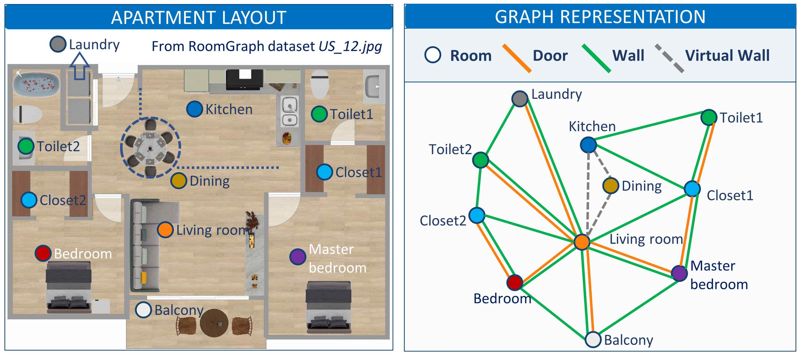

# Applying GNN to BIM graphs for semantic enrichment

<center> 

We present a novel approach of semantic enrichment, where we represent BIM models as graphs and apply GNNs to BIM graphs for semantic enrichment. 

We select a typical semantic enrichment task -- apartment room type classification -- to test our approach.

To achieve this goal, we created a BIM graph dataset, named **RoomGraph**, and modified a classic GNN algorithm to leverage both node and edge features, **SAGE-E**.

The RoomGraph dataset and the source codes of SAGE-E  are open to public research use. Enjoy!


# Requirements
- PyTorch
- DGL
- numpy
- pandas
- scikit-learn
- time


Training and testing SAGE-E does not need special configurations. The basic environment including the required libraries will be fine. 


### Folder structure
The following shows the basic folder structure.
```
├── code
│   ├── SAGEE.py # The architecture of the GNN algorithm.
│   ├── best_default.py # The selected model weight by authors.
│   ├── node_evaluation.py # The supplementary code for training process  
│   └── train&test.ipynb # The main code about training and test
├── dataset
    └──roomgraph.bin # The constructed graph dataset.
```

# Usage
Go to "code/train&test.ipynb". The code is explained step by step. 

## Bibtex
@upload later, still wait the paper publication

## Contact
Welcome to contact Zijian Wang (Zijian.wang@campus.technion.ac.il) if you have any questions. 

If you want to know more my work, please visit: https://zijianwang1995.github.io/
